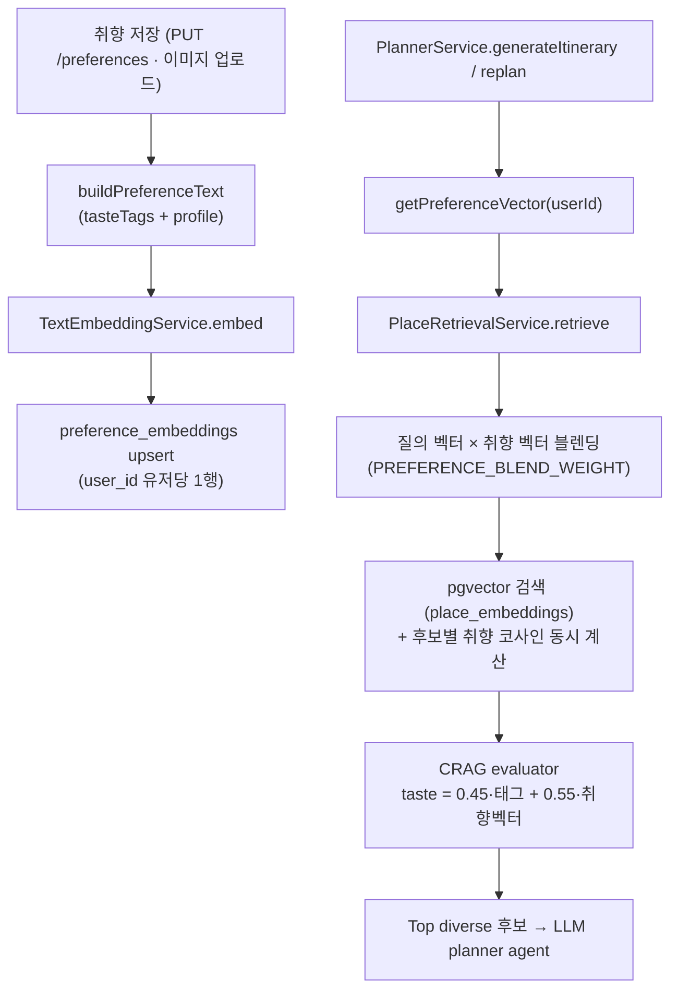

# TriPick 취향 벡터 개인화 & 취향 확장 v1

기준 브랜치: `feat/preference-vector-personalization`
작성일: 2026-07-06

## 1. 목적

두 가지 문제를 함께 해결한다.

1. **끊겨 있던 취향 임베딩 루프를 닫는다.** 기존에는 `preference_embeddings` 테이블에 벡터를 저장하기만 하고 어디서도 읽지 않았다(orphan write). place 검색은 취향을 키워드 텍스트로만 반영했고, 저장된 취향 벡터는 검색에 전혀 쓰이지 않았다.
2. **취향 페이지 입력을 더 구체적으로 받는다.** 기존 `travelStyles / companions / 취침·기상 / 이동수단 / 인스타 태그`에 더해 관심 테마·여행 페이스·활동 강도·분위기 선호를 추가하고, 이 값들이 임베딩 텍스트를 풍부하게 만들어 개인화 검색 품질로 이어지도록 한다.

즉 **취향을 더 구체적으로 받아 → 취향 벡터를 풍부하게 만들고 → 그 벡터로 place 검색을 개인화**하는 하나의 흐름을 완성한다.

## 2. 구현 파일

| 파일 | 역할 |
| --- | --- |
| `packages/types/src/preference.ts` | `InterestPreference`, `TravelPace`, `ActivityIntensity`, `CrowdPreference` 타입 추가 및 `PreferenceProfileDto` 확장 |
| `infra/postgres/init.sql` | `preference_embeddings`에 `user_id`(unique)·`updated_at` 추가 → 유저당 1행 upsert. 기존 볼륨 호환용 `ALTER ... IF NOT EXISTS` 포함 |
| `apps/api/src/embedding/embedding.module.ts` | 신설. `TextEmbeddingService`를 planner·preferences 공용 provider 로 노출 (순환참조 회피) |
| `apps/api/src/embedding/text-embedding.service.ts` | `planner/retrieval/`에서 이동. 텍스트→벡터 공용 서비스 (기존 로직 동일) |
| `apps/api/src/preferences/preference-text.ts` | 신설. 취향 태그 + 프로필을 place 임베딩과 같은 공간의 한국어 키워드 문장으로 직렬화 |
| `apps/api/src/preferences/preference-embedding.repository.ts` | 신설. `preference_embeddings` 유저당 1행 upsert / 벡터 조회 |
| `apps/api/src/preferences/preferences.service.ts` | `upsert` 시 취향+프로필 임베딩을 생성·저장, `getPreferenceVector` 추가. 신규 프로필 필드 병합 |
| `apps/api/src/preferences/preferences.module.ts` | `EmbeddingModule` import, `PreferenceEmbeddingRepository` provide |
| `apps/api/src/preference-analyzer/preference-analyzer.controller.ts` | 임베딩 생성을 `upsert`로 위임 (중복 `EmbeddingService` 제거) |
| `apps/api/src/preference-analyzer/embedding.service.ts` | 삭제 (preferences 로 통합) |
| `apps/api/src/planner/retrieval/types.ts` | `RetrievalContext.preferenceVector`, `RawPlaceCandidate.preferenceSimilarity`, `CragScore.personalization` 추가 |
| `apps/api/src/planner/retrieval/place-retrieval.service.ts` | 질의 벡터 × 취향 벡터 블렌딩 후 pgvector 검색 |
| `apps/api/src/planner/retrieval/place-embedding.repository.ts` | 취향 벡터 전달 시 후보별 취향 코사인을 SQL 에서 함께 계산 |
| `apps/api/src/planner/retrieval/crag-evaluator.service.ts` | taste 점수를 태그 매칭 + 취향 벡터 코사인으로 리랭킹 |
| `apps/api/src/planner/planner.service.ts` | 저장된 취향 벡터를 로드해 retrieval context 로 전달 |
| `apps/web/src/entities/preferences/model/options.ts` | 관심 테마·페이스·강도·분위기 옵션 + `INTEREST_TO_TASTE` 매핑 |
| `apps/web/src/entities/preferences/api/preferences-api.ts` | 기본값 확장 + interests → tasteTags 파생 |
| `apps/web/src/features/preference-setup/ui/preference-setup-form.tsx` | 관심 테마(다중)·페이스·강도·분위기(단일) 입력 블록 추가 |
| `apps/api/test/planner/retrieval/crag-evaluator.service.spec.ts` | 취향 벡터 리랭킹 fixture 테스트 추가 |
| `apps/api/test/planner/planner.service.spec.ts` | `getPreferenceVector` mock 추가 |

## 3. 개인화 검색 흐름



## 4. 개인화 방식 상세 (블렌딩 + 리랭킹)

### 4.1 질의 벡터 블렌딩

`PlaceRetrievalService`가 목적지·이벤트·취향키워드 텍스트로 만든 질의 벡터에 저장된 취향 벡터를 가중 결합한다.

```
search = normalize(query · w + preference · (1 - w))   // w = PREFERENCE_BLEND_WEIGHT (기본 0.6)
```

목적지 관련성(질의)을 조금 더 높게 두고, 취향 벡터가 검색 자체를 개인화한다. 취향 벡터가 없으면 순수 질의 벡터로 폴백.

### 4.2 CRAG 리랭킹

`place_embeddings` 검색 시 취향 벡터를 넘기면 SQL 에서 후보별 `1 - (embedding <=> preference)`를 함께 계산해 `preferenceSimilarity`로 반환한다. CRAG evaluator 는 이 값을 0~1 로 정규화한 `personalization` 점수를 만들고, taste 점수를 다음처럼 리랭킹한다.

```
taste = clamp(0.45 · 태그매칭점수 + 0.55 · personalization)   // 취향 벡터가 있을 때
```

pgvector 후보에만 벡터 유사도가 있으므로, kakao/seed fallback 후보는 기존 태그 매칭 점수를 그대로 쓴다.

## 5. 취향 확장 (신규 입력 차원)

| 차원 | 타입 | 값 | 비고 |
| --- | --- | --- | --- |
| 관심 테마 | `InterestPreference[]` | history, art, nature, nightview, photo, shopping, food, activity, cafe, local | 다중 선택, `INTEREST_TO_TASTE`로 tasteTags 파생 |
| 여행 페이스 | `TravelPace` | packed, balanced, relaxed | 단일 선택 |
| 활동 강도 | `ActivityIntensity` | active, moderate, restful | 단일 선택 |
| 분위기 선호 | `CrowdPreference` | hotspot, balanced, quiet | 단일 선택 |

신규 차원은 `buildPreferenceText`에서 한국어 키워드로 변환되어 취향 임베딩 텍스트를 구성한다. 예: `pace=relaxed → '여유로운 일정, 느긋한'`, `crowd=quiet → '한적한, 조용한, 숨은 명소'`. 이 텍스트가 임베딩되어 검색 개인화 벡터가 풍부해진다.

(예산 차원은 이번 범위에서 제외)

## 6. 하위호환 / 폴백

- `preferenceVector`, `preferenceSimilarity`, `personalization`은 모두 optional. 벡터가 없거나 pgvector 검색이 실패하면 기존 키워드 → kakao → seed 폴백 경로가 그대로 동작한다.
- 임베딩 엔드포인트가 죽어도 `TextEmbeddingService`의 결정적 해시 임베딩으로 폴백 → place seed 와 동일 공간을 유지해 블렌딩·코사인이 성립한다.
- 신규 프로필 필드는 `preferences.service.ts`의 `DEFAULT_PROFILE`·FE `DEFAULT_PREFERENCE_FORM`에서 기본값이 채워지므로, 기존 저장 데이터(jsonb)에 필드가 없어도 안전하게 병합된다.

## 6.5 임베딩 공간 정합성 & 재시드

취향 벡터와 place 벡터는 **같은 임베딩 공간**에 있어야 코사인·블렌딩이 의미를 갖는다. 둘 다 `TextEmbeddingService`를 타므로 원격 임베딩 서버가 있으면 실제 임베딩, 없으면 결정적 해시 임베딩으로 **일관되게** 만들어진다.

문제는 place 적재 파이프라인(`upsertPlace`)이 **insert-only** 라서, 해시 임베딩으로 한 번 채운 뒤 임베딩 서버를 켜도 기존 place 행이 갱신되지 않는다는 점이다. 이 경우 취향 벡터만 실제 임베딩이 되어 공간이 어긋나고, 차원(1536)은 같아 에러 없이 품질만 저하된다.

이를 위해 적재 CLI 에 `--reseed` 를 추가했다.

```bash
# 임베딩 서버를 켠 뒤, place 벡터를 새 공간으로 재생성
cd apps/api && pnpm ingest:places -- --reseed --regions=서울,부산
```

- `PlaceEmbeddingRepository.deleteRegion(region)` 이 적재 저장 라벨(예: '서울특별시')과 seed catalog 정규화 라벨(예: 'seoul')을 **모두** 삭제한 뒤 다시 채운다.
- `--reseed` 없이 실행하면 기존과 동일한 멱등 insert-only 동작(중복 skip).
- 전체 테이블을 비우려면 `TRUNCATE place_embeddings` 후 재적재도 가능.

### 취향 벡터 재임베딩 (place `--reseed` 와 짝)

place 만 재시드하면 취향 벡터는 여전히 예전(해시) 공간에 남아 **비대칭**이 된다. 취향 벡터는 사용자가 취향을 다시 저장할 때만 재생성되기 때문이다. 이를 위해 취향 측 재임베딩 CLI 를 추가했다.

```bash
# 임베딩 서버 전환 시 place 와 함께 실행
cd apps/api && pnpm ingest:places -- --reseed
cd apps/api && pnpm reembed:preferences
```

- `reembed:preferences` 는 `preferences` 테이블의 모든 취향(`tasteTags`+`profile`)을 [buildPreferenceText](../apps/api/src/preferences/preference-text.ts)로 재직렬화 → 현재 임베딩 소스로 재임베딩 → `preference_embeddings` 갱신 + `embeddingId` 갱신.
- 경량 `PreferenceReembedModule`(BullMQ/Redis 없이 ConfigModule + DataSource)로 동작.

### 차원 불일치 방어

`place-retrieval.service.ts` 는 저장된 취향 벡터의 차원이 질의 벡터와 다르면 개인화를 **건너뛴다**(경고 로그). 예전 차원으로 만들어진 취향 벡터가 pgvector 코사인(`<=> ::vector`)을 통째로 실패시켜 place 검색 결과가 사라지는 것을 막는다. 이 경고가 뜨면 `reembed:preferences` 로 재임베딩하면 된다.

## 7. 설정값

| 환경변수 | 기본값 | 설명 |
| --- | --- | --- |
| `PREFERENCE_BLEND_WEIGHT` | `0.6` | 질의 벡터 가중치. 1=순수 질의, 0=순수 취향 |
| `LLM_EMBEDDING_DIMENSIONS` | `1536` | 임베딩 차원 (기존과 동일) |

## 8. 검증

- API 유닛테스트: 6 suites / 17 tests 통과 (`pnpm --filter @tripick/api test`)
  - CRAG evaluator 취향 벡터 리랭킹 테스트 신규 추가
- API·web 타입체크 통과 (`tsc --noEmit`)
